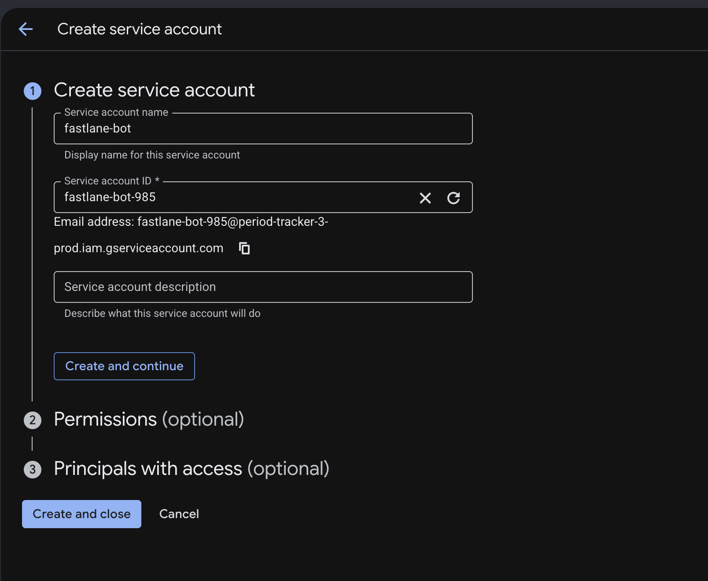
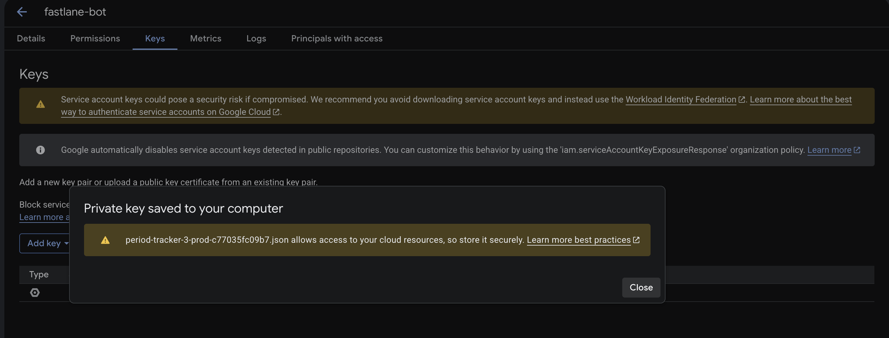
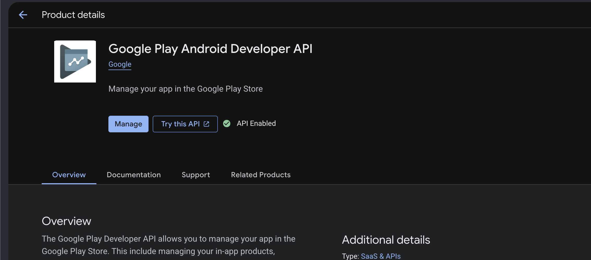
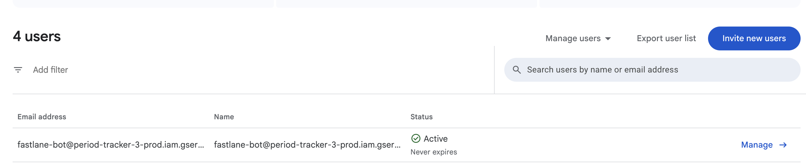
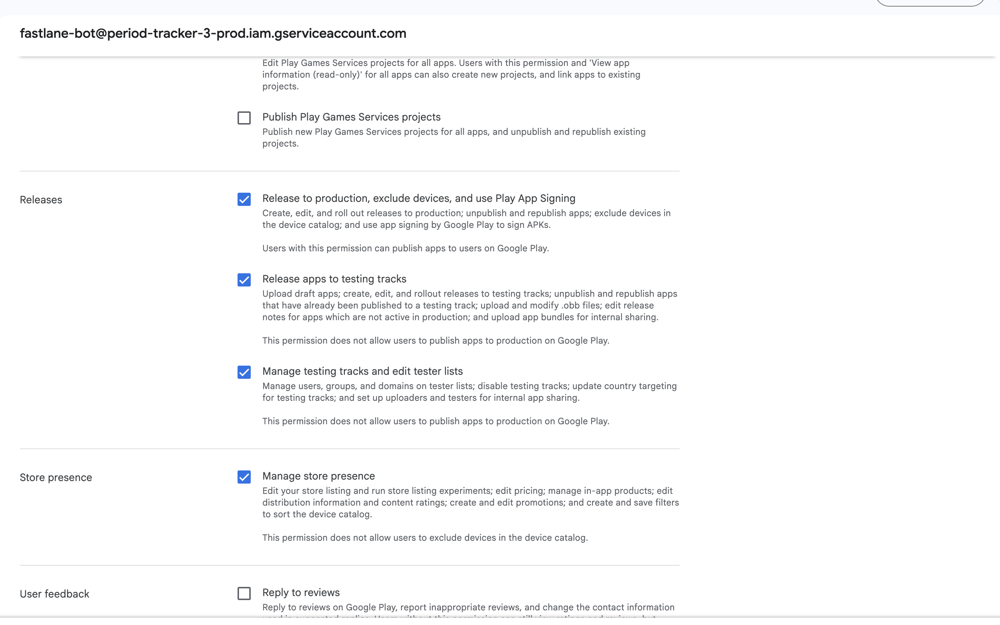
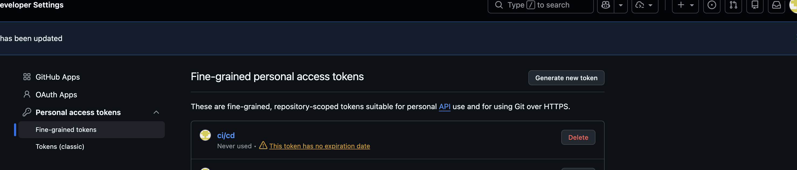

# Hướng Dẫn Cấu Hình Fastlane & GitHub Actions CI/CD Cho Dự Án Flutter (A-Z)

Tài liệu hướng dẫn chi tiết toàn bộ các bước thiết lập quy trình tự động hóa **CI/CD + Fastlane** để tự động build và upload ứng dụng Flutter lên **Google Play Console** (Internal Testing / Production).

---

## 📋 MỤC LỤC
1. [Phần 1: Cấu hình Google Cloud & Google Play Console](#phần-1-cấu-hình-google-cloud--google-play-console)
2. [Phần 2: Cấu hình GitHub Access Token & Repository Secrets](#phần-2-cấu-hình-github-access-token--repository-secrets)
3. [Phần 3: Cấu hình mã nguồn Flutter & Fastlane trong Repo](#phần-3-cấu-hình-mã-nguồn-flutter--fastlane-trong-repo)
4. [Phần 4: File Workflow GitHub Actions Mẫu (`deploy_android.yml`)](#phần-4-file-workflow-github-actions-mẫu-deploy_androidyml)
5. [Phần 5: Các sự cố thường gặp & Khắc phục (Gotchas & Troubleshooting)](#phần-5-các-sự-cố-thường-gặp--khắc-phục-gotchas--troubleshooting)

---

## PHẦN 1: CẤU HÌNH GOOGLE CLOUD & GOOGLE PLAY CONSOLE

### Bước 1.1: Tạo Service Account trên Google Cloud Console
1. Truy cập [Google Cloud Console](https://console.cloud.google.com/).
2. Chọn đúng **Project** liên kết với tài khoản Google Play Developer của bạn.
3. Ở menu trái, chọn **IAM & Admin** $\rightarrow$ **Service Accounts**.
4. Bấm **Create Service Account**:
   - **Service account name**: `fastlane-bot`
   - **Service account ID**: (tự động tạo, ví dụ `fastlane-bot@your-project-id.iam.gserviceaccount.com`)
   - Bấm **Create and Continue** $\rightarrow$ **Done**.



5. Trong danh sách Service Accounts, bấm vào email vừa tạo $\rightarrow$ Chuyển sang tab **Keys**.
6. Bấm **Add Key** $\rightarrow$ **Create new key** $\rightarrow$ Chọn định dạng **JSON** $\rightarrow$ Bấm **Create**.
7. Một file `*.json` sẽ được tải về máy của bạn (Hãy lưu lại, đổi tên thành `pc-api-key.json`).



---

### Bước 1.2: Bật Google Play Android Developer API
1. Trên Google Cloud Console, vào menu **APIs & Services** $\rightarrow$ **Library**.
2. Tìm kiếm từ khóa: `Google Play Android Developer API`.
3. Bấm vào kết quả tìm kiếm và bấm nút **ENABLE** (Bật).



---

### Bước 1.3: Cấp quyền cho Service Account trên Google Play Console
1. Truy cập [Google Play Console](https://play.google.com/console).
2. Vào mục **Users and permissions** (Người dùng và quyền) ở menu trái.
3. Bấm **Invite new users** (Mời người dùng mới).
4. Dán địa chỉ email Service Account (dạng `fastlane-bot@your-project-id.iam.gserviceaccount.com`) vào ô email.



5. Tại mục **App permissions** (Quyền ứng dụng): Thêm ứng dụng của bạn vào danh sách.
6. Tích chọn các quyền tối thiểu sau:
   - **Draft apps**: *Create, edit, and delete draft apps*
   - **Releases**:
     - *Release to production, exclude devices, and use Play App Signing*
     - *Release apps to testing tracks*
     - *Manage testing tracks and edit tester lists*
   - **Store presence**: *Manage store presence*
7. Bấm **Invite user** (hoặc **Save changes**) ở góc dưới cùng bên phải.



> [!IMPORTANT]
> **MẸO QUAN TRỌNG (Upload bản build đầu tiên bằng tay):**
> Google Play Developer API **nghiêm cấm** việc tự động đẩy AAB lên bằng API đối với ứng dụng mới tinh chưa từng có bản build nào.
> Trước khi dùng Fastlane, bạn **BẮT BUỘC phải vào Google Play Console và upload thủ công 1 file AAB đầu tiên bằng tay** vào nhánh Internal testing hoặc Production. Các lần phát hành tiếp theo Fastlane sẽ tự động 100%!

---

## PHẦN 2: CẤU HÌNH GITHUB ACCESS TOKEN & REPOSITORY SECRETS

### Bước 2.1: Tạo Fine-grained Personal Access Token (PAT) cho Private Packages
Nếu dự án của bạn sử dụng các package git private (ví dụ `custom_iap`, `flutter_drive_sync`,...):
1. Trên GitHub, vào **Settings** (Profile) $\rightarrow$ **Developer settings** $\rightarrow$ **Personal access tokens** $\rightarrow$ **Fine-grained tokens**.
2. Bấm **Generate new token**:
   - **Token name**: `CI_CD_PAT`
   - **Expiration**: 1 year (hoặc No expiration)
   - **Repository access**: Chọn **All repositories** (hoặc chọn Repo chính + TẤT CẢ các repo private dependency).
   - **Permissions**:
     - `Contents`: Read-only
3. Bấm **Generate token** và copy chuỗi token dạng `github_pat_11...`.



---

### Bước 2.2: Tạo Keystore & Mã hóa Base64 các secret
1. **Tạo Keystore Android (`upload-keystore.jks`):**
   ```bash
   keytool -genkey -v -keystore upload-keystore.jks -alias upload -keyalg RSA -keysize 2048 -validity 10000
   ```
2. **Chuyển Keystore sang mã Base64 (dạng 1 dòng không ngắt đoạn):**
   ```bash
   openssl base64 -A -in upload-keystore.jks
   ```
3. **Chuyển JSON Key Service Account sang mã Base64 (dạng 1 dòng không ngắt đoạn):**
   ```bash
   openssl base64 -A -in pc-api-key.json
   ```

---

### Bước 2.3: Thêm Repository Secrets bằng Script CLI Tự Động
Thay vì copy-paste thủ công 8 secrets lên giao diện web, bạn hãy tạo file `.env` ở gốc dự án (file này đã được thêm vào `.gitignore` nên an toàn tuyệt đối):

**Tạo file `.env`:**
```env
ANDROID_KEYSTORE_BASE64=<Chuỗi Base64 của file upload-keystore.jks>
ANDROID_KEYSTORE_PASSWORD=your_keystore_password
ANDROID_KEY_ALIAS=your_key_alias
ANDROID_KEY_PASSWORD=your_key_password
PLAY_STORE_JSON_KEY_BASE64=<Chuỗi Base64 của file pc-api-key.json>
GH_PAT=github_pat_11...
TELEGRAM_BOT_TOKEN=your_telegram_bot_token
TELEGRAM_CHAT_ID=your_telegram_chat_id
```

**Chạy Script đẩy toàn bộ Secrets lên GitHub bằng GitHub CLI (`gh`):**
```bash
while IFS='=' read -r key value; do
  if [[ -n "$key" && "$key" != \#* ]]; then
    gh secret set "$key" --body "$value"
    echo "Đã thêm secret: $key"
  fi
done < .env
```

---

## PHẦN 3: CẤU HÌNH MÃ NGUỒN FLUTTER & FASTLANE TRONG REPO

### Bước 3.1: Cấu hình Fastlane
1. Tạo thư mục `android/fastlane/` trong dự án.
2. Tạo file **`android/fastlane/Appfile`**:
   ```ruby
   json_key_file("fastlane/pc-api-key.json")
   package_name("com.yourdomain.yourapp") # Thay bằng ApplicationId bản prod của bạn
   ```
3. Tạo file **`android/fastlane/Fastfile`**:
   ```ruby
   require 'yaml'

   default_platform(:android)

   platform :android do
     desc "Upload AAB to Google Play Internal Track"
     lane :deploy_internal do |options|
       aab_path = options[:aab] || Dir[File.expand_path("../../build/app/outputs/bundle/prodRelease/*.aab", __dir__)].first

       upload_to_play_store(
         track: 'internal',
         aab: aab_path,
         package_name: 'com.yourdomain.yourapp', # Thay đúng Package Name bản prod
         json_key: 'fastlane/pc-api-key.json',
         skip_upload_apk: true,
         skip_upload_metadata: true,
         skip_upload_changelogs: true, # Đặt true cho internal track để chạy nhanh & tránh lỗi locale
         skip_upload_images: true,
         skip_upload_screenshots: true
       )
     end

     desc "Upload AAB to Google Play Production Track"
     lane :deploy_prod do |options|
       aab_path = options[:aab] || Dir[File.expand_path("../../build/app/outputs/bundle/prodRelease/*.aab", __dir__)].first
       pubspec_path = File.expand_path("../../pubspec.yaml", __dir__)
       pubspec = YAML.load_file(pubspec_path)
       version = pubspec['version'].to_s
       version_code = version.split('+').last

       upload_to_play_store(
         track: 'production',
         aab: aab_path,
         package_name: 'com.yourdomain.yourapp', # Thay đúng Package Name bản prod
         json_key: 'fastlane/pc-api-key.json',
         version_code: version_code,
         skip_upload_apk: true,
         skip_upload_metadata: true,
         skip_upload_changelogs: false,
         skip_upload_images: true,
         skip_upload_screenshots: true
       )
     end
   end
   ```

---

### Bước 3.2: Cấu hình `.gitignore`
Thêm các dòng sau vào `.gitignore` để không bao giờ push khóa và bí mật lên Git:
```gitignore
# Fastlane & Build Secrets
**/fastlane/pc-api-key.json
**/fastlane/report.xml
**/fastlane/Preview.html
**/fastlane/screenshots
**/fastlane/test_output
**/fastlane/*.json
android/app/upload-keystore.jks
android/app/*.keystore
android/app/*.jks
android/keystore.jks
android/key.properties
.env
```

> [!CAUTION]
> **Loại bỏ file nhạy cảm khỏi Git Index (nếu đã lỡ commit):**
> Run `git rm --cached <file_path>` để xóa file khỏi theo dõi Git nhưng vẫn giữ nguyên file cục bộ ở máy local.

---

### Bước 3.3: Sửa Gradle Build (Bảo vệ môi trường CI & Tắt Lint Vital)

1. **Bọc script mở folder desktop trong kiểm tra môi trường CI:**
   - **File `build.gradle` (Groovy):**
     ```groovy
     if (System.getenv("CI") == null && System.getenv("GITHUB_ACTIONS") == null) {
         try {
             def os = System.getProperty("os.name").toLowerCase()
             if (os.contains("windows")) exec { commandLine 'cmd', '/c', 'start', '', outputDir }
             else if (os.contains("mac")) exec { commandLine 'open', outputDir }
             else if (os.contains("linux")) exec { commandLine 'xdg-open', outputDir; ignoreExitValue = true }
         } catch (Exception e) {}
     }
     ```
   - **File `build.gradle.kts` (Kotlin DSL):**
     ```kotlin
     if (System.getenv("CI") == null && System.getenv("GITHUB_ACTIONS") == null) {
         val os = System.getProperty("os.name").lowercase()
         when {
             os.contains("windows") -> exec { commandLine("cmd", "/c", "start", "", folderPath) }
             os.contains("mac") -> exec { commandLine("open", folderPath) }
             else -> exec { commandLine("xdg-open", folderPath) }
         }
     }
     ```

2. **Tắt `lintVital` check trên release build để tránh lỗi intermediate lint file khi dùng Gradle 8.14 + Firebase SDKs:**
   - **File `build.gradle` (Groovy):**
     ```groovy
     android {
         ...
         lintOptions {
             checkReleaseBuilds false
             abortOnError false
         }
     }
     ```
   - **File `build.gradle.kts` (Kotlin DSL):**
     ```kotlin
     android {
         ...
         lint {
             checkReleaseBuilds = false
             abortOnError = false
         }
     }
     ```

3. **Nâng cấp Gradle Wrapper lên `8.14` (Yêu cầu bắt buộc của Flutter 3.41+):**
   Trong `android/gradle/wrapper/gradle-wrapper.properties`:
   ```properties
   distributionUrl=https\://services.gradle.org/distributions/gradle-8.14-all.zip
   ```

---

## PHẦN 4: FILE WORKFLOW GITHUB ACTIONS CHUẨN (`.github/workflows/deploy_android.yml`)

Tạo file `.github/workflows/deploy_android.yml`:

```yaml
name: Deploy Android to Google Play Internal

on:
  push:
    branches:
      - 'release/android'
      - 'main'
  workflow_dispatch:

jobs:
  deploy:
    runs-on: ubuntu-latest
    permissions:
      contents: write

    steps:
      - name: Checkout Repository
        uses: actions/checkout@v4
        with:
          submodules: recursive
          persist-credentials: false

      - name: Set up Java 17
        uses: actions/setup-java@v4
        with:
          distribution: 'temurin'
          java-version: '17'

      - name: Set up Flutter 3.41.9
        uses: subosito/flutter-action@v2
        with:
          flutter-version: '3.41.9'
          channel: 'stable'
          cache: true

      - name: Set up Ruby & Fastlane
        uses: ruby/setup-ruby@v1
        with:
          ruby-version: '3.2'

      - name: Install Fastlane
        run: gem install fastlane --no-document

      - name: Restore Caches
        uses: actions/cache@v4
        with:
          path: |
            ~/.gradle/caches
            ~/.gradle/wrapper
            ~/.pub-cache
          key: ${{ runner.os }}-build-${{ hashFiles('**/*.gradle*', 'pubspec.lock') }}
          restore-keys: |
            ${{ runner.os }}-build-

      - name: Setup Keystore & key.properties
        run: |
          echo "$ANDROID_KEYSTORE_BASE64" | tr -d '[:space:]' | base64 -d > android/app/upload-keystore.jks
          cat > android/key.properties <<EOF
          storePassword=${{ secrets.ANDROID_KEYSTORE_PASSWORD }}
          keyPassword=${{ secrets.ANDROID_KEY_PASSWORD }}
          keyAlias=${{ secrets.ANDROID_KEY_ALIAS }}
          storeFile=upload-keystore.jks
          EOF
        env:
          ANDROID_KEYSTORE_BASE64: ${{ secrets.ANDROID_KEYSTORE_BASE64 }}

      - name: Setup Google Play Service Account JSON Key
        run: |
          mkdir -p android/fastlane
          echo "$PLAY_STORE_JSON_KEY_BASE64" | tr -d '[:space:]' | base64 -d > android/fastlane/pc-api-key.json
        env:
          PLAY_STORE_JSON_KEY_BASE64: ${{ secrets.PLAY_STORE_JSON_KEY_BASE64 }}

      - name: Configure Git for Private Dependencies
        run: |
          if [ -z "$GH_PAT" ]; then
            echo "::error::Secret GH_PAT is empty or not set in Repository Secrets!"
            exit 1
          fi
          echo "Configuring git extraheader with GH_PAT..."
          B64_PAT=$(echo -n "${GH_PAT}:" | base64 | tr -d '\n')
          git config --global --unset-all http.https://github.com/.extraheader || true
          git config --global http.https://github.com/.extraheader "AUTHORIZATION: basic ${B64_PAT}"
          git config --global url."https://github.com/".insteadOf "git@github.com:"
        env:
          GH_PAT: ${{ secrets.GH_PAT }}

      - name: Install Flutter Dependencies & Codegen
        run: |
          flutter pub get
          flutter gen-l10n || true
          dart run build_runner build --delete-conflicting-outputs || true

      - name: Build Android App Bundle (AAB)
        run: flutter build appbundle --flavor prod -t lib/main.dart

      - name: Create and Push Git Tag
        run: |
          VERSION=$(grep '^version:' pubspec.yaml | awk '{print $2}')
          TAG_NAME="v$VERSION"
          echo "Version from pubspec.yaml: $VERSION"
          echo "Target tag: $TAG_NAME"
          if git ls-remote --tags origin | grep -q "refs/tags/$TAG_NAME"; then
            echo "Tag $TAG_NAME already exists on remote, skipping tag creation."
          else
            git config user.name "github-actions[bot]"
            git config user.email "github-actions[bot]@users.noreply.github.com"
            git tag -a "$TAG_NAME" -m "Release $TAG_NAME"
            git push "https://x-access-token:${{ secrets.GITHUB_TOKEN }}@github.com/${{ github.repository }}.git" "$TAG_NAME" || true
          fi

      - name: Deploy to Google Play Internal via Fastlane
        run: |
          cd android
          fastlane deploy_internal

      - name: Send Telegram Notification
        if: always()
        uses: appleboy/telegram-action@master
        with:
          to: ${{ secrets.TELEGRAM_CHAT_ID }}
          token: ${{ secrets.TELEGRAM_BOT_TOKEN }}
          format: markdown
          message: |
            🚀 *${{ github.workflow }}*
            *Trạng thái:* ${{ job.status == 'success' && '🟢 THÀNH CÔNG' || '🔴 THẤT BẠI' }}
            *Repository:* `${{ github.repository }}`
            *Branch:* `${{ github.ref_name }}`
            *Commit:* `${{ github.sha }}`
            
            🔗 [Xem chi tiết Log trên GitHub Actions](https://github.com/${{ github.repository }}/actions/runs/${{ github.run_id }})
```

---

## PHẦN 5: CÁC SỰ CỐ THƯỜNG GẶP & KHẮC PHỤC (GOTCHAS & TROUBLESHOOTING)

| Lỗi gặp phải | Nguyên nhân | Cách khắc phục |
| :--- | :--- | :--- |
| `base64: invalid input` | Chuỗi Base64 trong Secret chứa ngắt dòng/khoảng trắng làm ngắt lệnh `base64 -d` của Linux. | Thêm `tr -d '[:space:]'` trước khi pipe sang `base64 -d`: `echo "$SECRET" \| tr -d '[:space:]' \| base64 -d`. |
| `Write access to repository not granted` (403 Error khi push tag) | Lệnh git push mang header `GH_PAT` (vốn chỉ có quyền Read-only) ra xác thực thay vì dùng token của repo. | Chỉ định dùng `GITHUB_TOKEN` trực tiếp khi push tag: `git push "https://x-access-token:${{ secrets.GITHUB_TOKEN }}@github.com/${{ github.repository }}.git" "$TAG_NAME"`. |
| `lintVitalAnalyzeRelease` Failed | Gradle 8.14 kiểm tra lint vital nghiêm ngặt các file trung gian release của Firebase SDK. | Thêm `checkReleaseBuilds false` (Groovy) hoặc `checkReleaseBuilds = false` (Kotlin DSL) vào `android { ... }`. |
| `Your project's Gradle version is lower than Flutter's minimum supported version` | Version Gradle Wrapper quá cũ. | Nâng `distributionUrl` lên `gradle-8.14-all.zip` trong `gradle-wrapper.properties`. |
| `Unsupported class file major version 69` | Máy local dùng Java 25 (Android Studio bundled JBR) quá mới với Gradle 8.14. | Dùng OpenJDK 17/21 bằng `flutter config --jdk-dir="path/to/openjdk17"`. Trên CI, workflow đã cố định Java 17. |
| `Process 'command 'xdg-open'' finished with non-zero exit value` | Gradle chạy script mở folder giao diện desktop trên máy Linux CI. | Bọc đoạn script trong `if (System.getenv("CI") == null && System.getenv("GITHUB_ACTIONS") == null)` trong Gradle. |
| `Error: The operation was canceled.` | Cấu hình `org.gradle.jvmargs=-Xmx8G` vượt quá dung lượng RAM 7GB của runner GitHub Actions, khiến Linux OOM Killer đột ngột tiêu diệt tiến trình. | Giảm `-Xmx8G` xuống `-Xmx4096m -XX:MaxMetaspaceSize=1024m` trong `android/gradle.properties` và đặt `org.gradle.workers.max=2`. |
