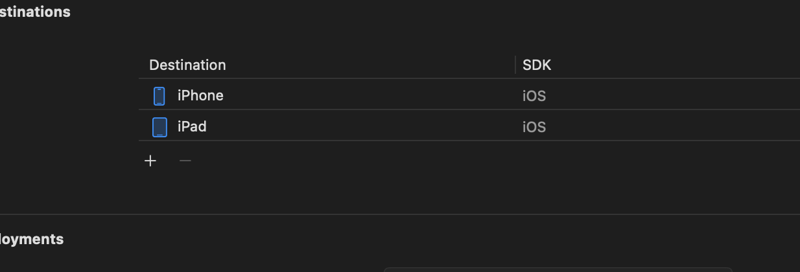

# Lỗi không tìm thấy iOS Simulator khi chạy ứng dụng

## Mô tả lỗi

Khi chạy ứng dụng iOS trên simulator, bạn có thể gặp lỗi như sau:

```bash
Unable to find a destination matching the provided destination specifier:
    { id:D3A10381-3900-4B9D-979B-08983CF1073C }

The requested device could not be found because no available devices matched the request.

Available destinations for the "dev" scheme:
    { platform:macOS, arch=arm64, variant=Designed for [iPad,iPhone], id=00006000-000E58E03488401E }
    { platform:iOS, id=dvtdevice-DVTiPhonePlaceholder-iphoneos:placeholder, name=Any iOS Device, error=iOS 17.0 is not installed. To use with Xcode, first download and install the platform }
    { platform:iOS Simulator, id=dvtdevice-DVTiOSDeviceSimulatorPlaceholder-iphonesimulator:placeholder, name=Any iOS Simulator Device }
```

## Nguyên nhân

Lỗi này xảy ra do cấu hình **Excluded Architectures** trong project bao gồm `arm64`, khiến cho Xcode không thể tìm thấy các simulator phù hợp trên máy Mac M1/M2/M3 (sử dụng chip Apple Silicon).

## Cách khắc phục

### Bước 1: Mở Build Settings

1. Mở project trong Xcode
2. Chọn project của bạn trong Project Navigator
3. Chọn target của ứng dụng
4. Chọn tab **Build Settings**
5. Tìm kiếm "Excluded Architectures"

### Bước 2: Xóa arm64 khỏi Excluded Architectures

Trong mục **Excluded Architectures**:
- Nếu thấy `arm64` trong phần **Debug** hoặc **Release**
- **Xóa bỏ** tất cả các giá trị `arm64` 
- Để trống hoặc chỉ giữ các architecture khác nếu cần thiết

### Bước 3: Clean và Rebuild

1. Clean build folder: **Product** → **Clean Build Folder** (hoặc `Cmd + Shift + K`)
2. Build lại project: **Product** → **Build** (hoặc `Cmd + B`)
3. Chọn simulator và chạy ứng dụng

## Giải thích

Trên các máy Mac sử dụng chip Apple Silicon (M1/M2/M3), iOS Simulator chạy native trên kiến trúc `arm64`. Khi cấu hình **Excluded Architectures** có chứa `arm64`, Xcode sẽ không build cho kiến trúc này, dẫn đến việc không thể tìm thấy simulator phù hợp.

Việc xóa `arm64` khỏi **Excluded Architectures** sẽ cho phép Xcode build và chạy ứng dụng trên iOS Simulator một cách bình thường.

## Lưu ý

- Cấu hình này cần được kiểm tra cho cả **project** và **target**
- Nếu bạn sử dụng CocoaPods, có thể cần kiểm tra cấu hình trong Pods project
- Đối với Flutter project, kiểm tra cả trong `ios/Runner.xcworkspace`

## Các bước khắc phục bổ sung khác

### Xóa DerivedData (cache build + index - nguyên nhân gây crash nhiều nhất)

Khi Xcode bị lỗi scheme hoặc không tìm thấy simulator, hãy xóa cache:

```bash
rm -rf ~/Library/Developer/Xcode/DerivedData
```

Sau đó:
1. Mở Xcode lại
2. **Clean Build Folder** (`⇧⌘K`)
3. Thử click scheme picker hoặc chạy lại

### Xóa toàn bộ scheme cache & reset workspace

1. **Đóng Xcode**
2. Vào thư mục project Flutter → ios:
   ```bash
   rm -rf xcuserdata *.xcworkspace/xcshareddata
   ```
3. Mở lại `ios/Runner.xcworkspace` trong Xcode (không mở `.xcodeproj`)
4. Xcode sẽ tự động regenerate schemes → thử chọn scheme "Runner" hoặc "dev" lại

## Đảm bảo Xcode tìm thấy thiết bị chạy là Simulator

Để chắc chắn rằng Xcode có thể tìm thấy và chạy ứng dụng trên iOS Simulator, hãy thực hiện các bước sau:

### 1. Chọn đúng Scheme và Destination

Tại thanh công cụ Xcode, hãy chọn:
- **Scheme**: Chọn scheme của ứng dụng (ví dụ: `dev` hoặc `Runner`)
- **Device**: Chọn simulator cụ thể (ví dụ: `iPhone 17 Pro`)


*Hình ảnh hiển thị cách chọn scheme "dev" và thiết bị simulator "iPhone 17 Pro"*

### 2. Kiểm tra Destination Settings

Đảm bảo rằng destination settings của bạn bao gồm các thiết bị iOS simulator:


*Hình ảnh hiển thị cấu hình destination với các tùy chọn iPhone và iPad*

Nếu bạn không thấy simulator trong danh sách, hãy:
1. Mở **Xcode** → **Settings** → **Locations**
2. Kiểm tra **Command Line Tools** được set đúng
3. Thử reset simulator: **Simulator** → **Device** → **Erase All Content and Settings...**
