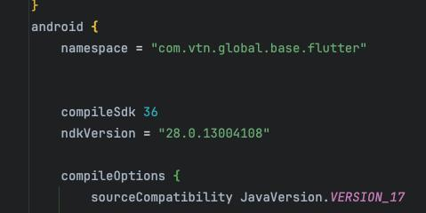
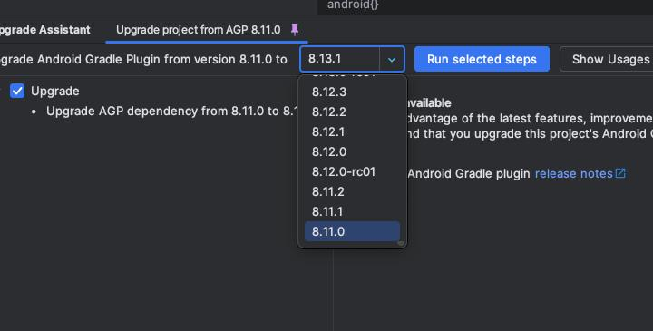
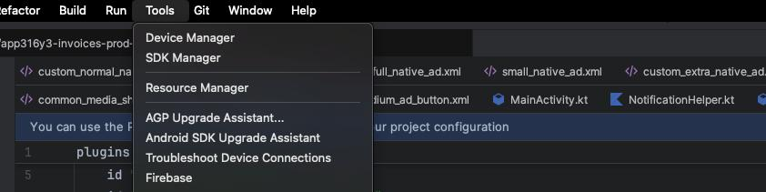

# Hướng dẫn update fix lỗi 16kb (Android 15)

Dưới đây là các bước để cập nhật dự án Flutter nhằm hỗ trợ page size 16KB trên Android 15.

## Các bước thực hiện

### 1. Nâng cấp Flutter
Nâng cấp Flutter SDK lên phiên bản **3.35** hoặc mới hơn.

### 2. Nâng cấp các package
Chạy lệnh sau trong terminal để nâng cấp các package trong dự án lên phiên bản major mới nhất:

```bash
flutter pub upgrade --major-versions
```

### 3. Cập nhật NDK Version
Mở file `build.gradle` (thường nằm trong `android/app/build.gradle`) và cập nhật `ndkVersion` thành `"28.0.13004108"`.



### 4. Mở AGP Upgrade Assistant
Mở thư mục `android` của dự án bằng **Android Studio**. Sau đó vào menu **Tools** -> **AGP Upgrade Assistant**.



### 5. Nâng cấp AGP lên 8.11
Trong giao diện AGP Upgrade Assistant, chọn phiên bản **8.11**, sau đó nhấn nút **Run selected steps** để tiến hành nâng cấp tự động.


